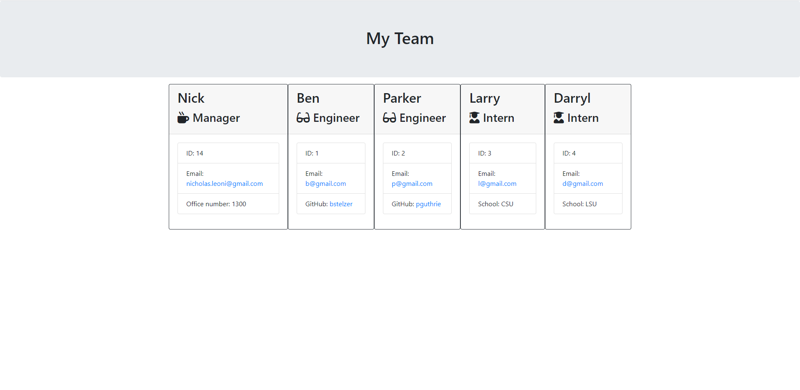

# HW_EMPLOYEE_SUMMARY

## Desription
    The objective of the homework was to generate an Employee Summary using inquirer which renders into an team.HTML file. The first portion of the homework was to run tests to ensure the constructor classes are configured correctly. From there it is building out the inquirer portion to create employess which incorportaes logic to render the appropriate data for each employee.

## Table of Contents
 - [Installation](#installation)
 - [Usage](#usage)
 - [License](#license)
 - [Contributing](#contributing)
 - [Tests](#tests)
 - [Questions](#questions)

## Installation
    npm install in order to ensure inquirer and jest is available    
## Usage
    run tests, then run node app.js to create emplyee list
## License
    
## Contributing
    Nick Leoni
## Tests
    npm run test
## Questions
[GitHub Repo Link](https://github.com/njleoni/HW_EMPLOYEE_SUMMARY)[Screencastify Link](https://drive.google.com/file/d/1blyIeK_zu2er9EGj-naNc9nrJ0remABM/view)
#### If you have any additional questions, please contact me at nicholas.leoni@gmail.com

## Screenshot

